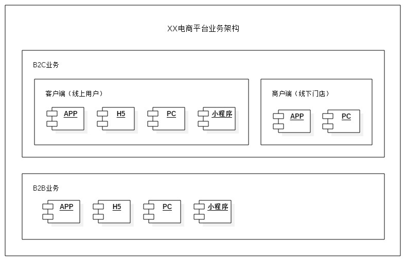
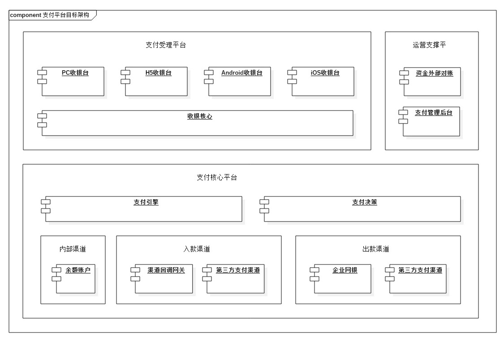
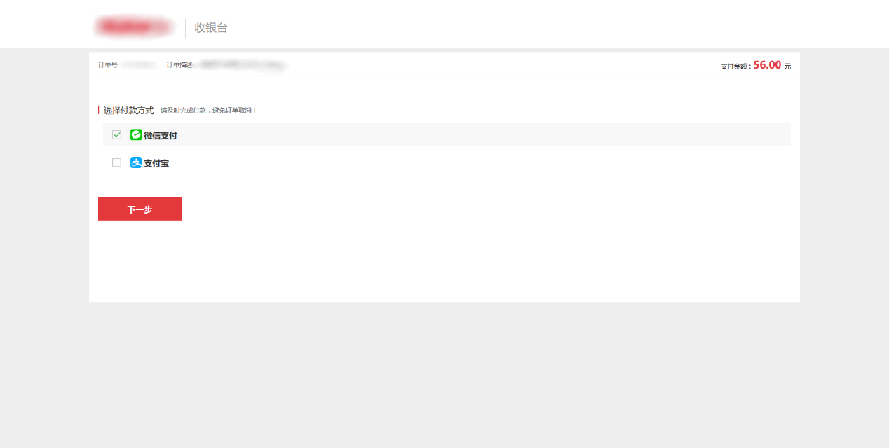
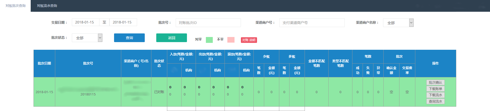
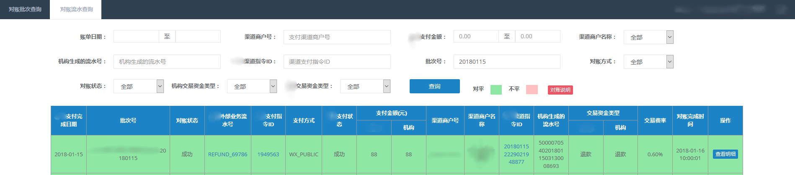

XX电商平台从2017年初开始筹备支付系统改造，至今历时一年。目前项目仍处于收尾阶段，但支付平台内相关系统已基本搭建完成。在此，简单分享一下改造方案、新搭建的支付平台架构以及实施过程中遇到的一些问题。

**I. 平台业务介绍**

XX电商平台整体业务包括B2B和B2C两大部分。

2C的业务根据消费场景不同，分为用户线上下单，在线支付和用户线上下单、到店支付。在线支付主要通过第三方支付的线上支付产品实现，未接入快捷支付或认证支付。线下支付的付款方式有当面付扫码（主扫、被扫）、POS刷卡、智能POS。2C业务的C端用户（客户端）及B端线下门店（商户端），分别属于不同系统维护。

2B的商品销售主要通过在线支付完成，少量大额订单可能采用线下银行转账形式支付。银行转账的订单会在业务订单内标注具体的付款方式，由财务人员在对应收款银行账户内核实款项是否到账。

图1 平台业务介绍

**II. 系统现有问题**

首先，公司的2C和2B的业务分属于不同研发团队，因此两大业务的各个前端应用均采用自行接入支付渠道的方式实现。没有面向全公司前端提供的可供统一调用的收银台，也没有建立支付回调网关。支付相关逻辑也散落在独立的系统内，缺乏集中管控。如果某个第三方支付通道需要切换或者新增一个渠道，需要各个系统分别开发，维护成本极高。

其次，由于没有对用户的支付行为形成独立的支付订单，第三方支付的回调结果只能在业务订单上进行维护，这就导致了支付信息、支付状态记录不完善的问题，无法及时进行差错处理。比如，用户发起一笔在线支付，某一应用端服务在接收到支付回调前，如果用户手工取消了订单，订单服务就不会再更新任何支付信息。

同时，因为支付信息记录在业务订单内，所以外部的渠道对账和内部的业务对账难度增大，需要大量财务人员参与对账工作，系统化运作艰难。

此外，第三方支付退款接入也不够完善。部分渠道原路返回用户支付账户的功能都是通过财务在第三方商户后台手动打款完成，日终时手工记账，再隔日通过对账单人工对账。

**III. 支付改造需求**

通过分析和梳理支付业务的实现方式，经过多轮调研，理清支付平台跟各业务端以及业务订单的关系。首先确认了，需要将资金相关逻辑从订单系统中剥离。

同时，向各终端提供统一调用的收银台，整合前端支付受理，支持按业务类型、订单渠道等多维度定制支付方式。定义统一的支付渠道接入规范，提供可插拔的渠道接入方式。

新建支付核心平台，统一维护支付指令，抽象出公共的支付服务，满足出款、入款、内部账户转账、余额支付等业务需求。

由支付平台完成与金融机构（含第三方支付、银行等）所有的外部对接，实现与基于会计原则设计的结算中心和金蝶账务软件的系统集成。

**IV. 支付平台架构**

图2 支付平台架构

1.  **支付受理平台**

收拢各业务端收银台，解决收银台的统一问题。不同终端的收银台，提供不同终端的收银台目的是为了统一收银逻辑，但此处收银台只包含视图逻辑，业务逻辑封装在支付受理核心中。

支付受理核心维护了收银台的模型：包含支付方式、风控策略、支付前置校验等逻辑，并调用支付引擎的支付接口完成支付。

1.  **支付核心平台**

支付引擎，向上层系统提供公共的支付出、入、转、退服务，维护支付指令，定义渠道接入规范接口、渠道等完成支付流程的执行，支付的执行机构。

支付决策，定义支付流程、渠道路由，具备按照业务动态配置的能力，是支付的决策机构。

内部渠道，内部账户（主要为余额账户）将在内部渠道作为一种支付渠道进行处理。

入款渠道，包含所有业务端已经独立接入的第三方支付渠道和银行渠道：微信、支付宝、翼支付、拉卡拉等，这些渠道实现了支付引擎的统一渠道接口。渠道回调网关，三方渠道系统主动请求XX系统的入口，统一接收各三方渠道的回调。

出款渠道，公司出款分为两类，订单退款采用第三方支付接口完成，遵循原路返回的原则，大于原支付金额的部分，经由专用的第三方支付、银行转账账户完成。支付指令，账务记账等逻辑相同，需要在支付平台内做统一管控。通过企业网银完成的手工打款暂未纳入体系。

1.  **运营支撑平台**

资金对账，从支付引擎同步渠道入账流水，从渠道获取三方清算流水，完成支付订单与外部金融机构（含第三方支付）的外部对账。同时，将对账结果推送至财务系统的结算中心，由财务系统完成业务订单的内部对账。

支付管理后台，给产品、研发、运营等公司内部人员的后台支撑功能，主要包含收银台配置、支付订单相关的配置以及查询功能。

**V. 改造成果示例**

1.  **收银台可配置**

通过支付产品编码的方式，控制收银台的应用类型（H5、PC、SDK），同时标注该笔发起该笔支付的支付业务类型、支付类型、来源平台、终端类型、收银台展示的付款方式等等。产品经理或运营人员，可以根据第三方支付渠道运营活动（如满减）调整收银台付款方式显示顺序，也可以根据具体的业务类型，增减支付方式（如虚拟商品不支持花呗支付）。

2C业务官网配置及收银台展示如下：

图3 2C官网收银台配置

图4 2C官网收银台

1.  **渠道对账管理**

对账系统生成对账任务，对账任务执行期间，将按照对账批次逐条解析对账文件。为了确保对账过程覆盖单边账情况，对账过程将进行双侧对账：渠道侧对账文件与支付平台支付单核对、支付平台支付单与渠道侧对账文件核对。对账批次全量执行后，生成该批次的对账结果。如果批次内待解析的渠道对账文件存在格式错误等情况，该批次执行状态将置为异常。同时，对于处理中的批次，如果处理中断，支持重试机制。

对账结果将以对账流水形式保存，单条对账流水内拼接支付单及渠道侧账单信息。双侧对账存在多账（渠道有记录、平台无记录）、少账（渠道无记录、平台有记录）、金额不匹配（支付单金额不等于账单金额），无论是否双侧记录都存在，均需要保存拼接后的流水信息。对账批次执行完成后，统计批次内的付款、收款、退款笔数和金额，手续费支出和收入，以及多账、少账、金额不匹配笔数和金额，同时更新统计数据至该对账批次。

对账系统页面示例：

图5 对账批次管理

图6 对账流水管理

**VI. 分享后Q&A**

Q1:能否介绍一下支付订单的支付阶段是什么含义？

答：用户发起的支付请求可能会涉及组合支付，如预付卡金额不足时，需要使用其他支付方式补足，这时候就会使用到支付阶段。分为两个阶段执行，先执行调用第三方渠道支付，再执行预付卡扣款。

Q2:三方支付异步通知给支付平台，支付平台通知内部调用方，掉单支付平台会主动查询三方支付然后再异步通知给内部吗？

答：掉单类型不一样，处理方式不一样。1）如果支付单状态是成功，而业务单没有更新成功，支付平台重试一定次数后会报警。2）如果支付单是待处理或者失败，之后拿到新的回调结果是成功，支付平台只会更新支付单，业务单不做处理，等T+1内部对账结果。3）重复支付，目前业务单只会记录一笔支付单记录，但这笔操作在支付平台内有两笔支付单。系统会每日归结重复支付的订单，财务确认后，原路返回。

Q3:支付路由主要做什么，收银台支付渠道应该都是用户自己选择的？

答：支付路由在支付平台中，目前主要用作通道的调整，比如门店当面付，我们除了直连微信、支付宝的通道外，条码付还连了上海银行、微众银行的通道，根据渠道的稳定性、费率情况可以动态切换通道。

Q4:退款有一部分是非原路退回，使用其它大额通道，支付是为什么不考虑大额通道，费用问题？

答：目前非原路退款，使用在大于订单款项的理赔或者其他支出，使用专门的支付宝账户走支付宝转账接口。

Q5:转账到支付宝账户，如何关联平台的用户和支付宝账号？A身份证号为ID1，绑了身份证号ID2的支付宝，怎么处理？我了解绑定支付宝时拿不到身份证信息的。

答：让用户提供需要转账的支付宝账号的，不做用户身份信息的核实。
