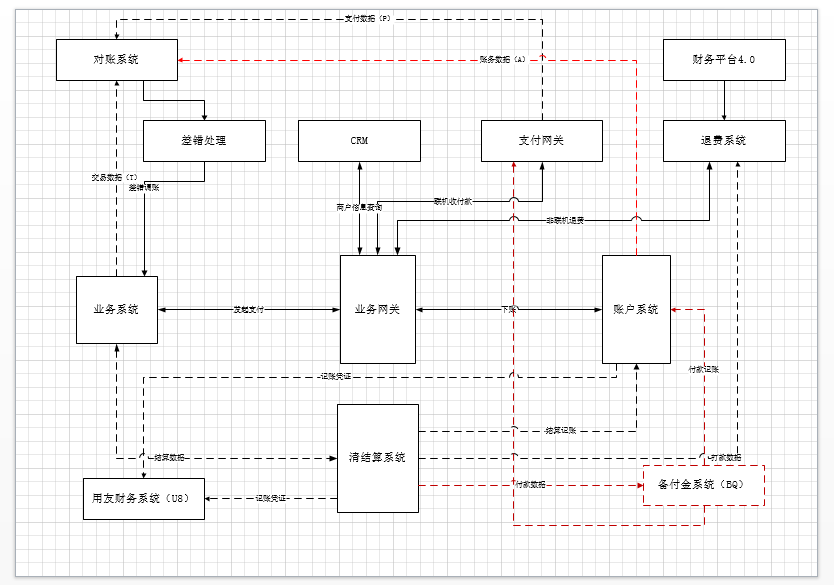

大家好，我是新生支付运营负责人陈志华，非常高兴今天能和大家一起分享交流，今天我要分享的内容是支付平台系统边界；

之前大家分析的内容我也看了，可能更多的是站在技术的角度；今天我就从非技术角度和大家分享一下运营眼中的支付平台； 

首先发一下我画的支付平台系统边界图； 

 

那我现在就结合这个图来讲一下。

在讲之前 我先讲一下我们大概有多少系统模块：1、业务系统  2、业务网关 
3、帐户系统  4、CRM  5、支付网关  6、退费系统  7、财务平台    8、对帐系统
9、差错处理系统  10、清结算系统  11、备付金系统   12、用友财务系统 

那现在我开始讲一下一笔订单在支付平台中各个系统之间是如何流转的 

首先业务系统收到商户发来的收付款请求，业务系统会向业务网关发起支付请求，业务网关向CRM发起商户信息查询并进行产品开通的确认与校验，校验通过向支付网关发起联机收付款请求，支付网关负责向银行前置发起请求，支付成功后支付网关将付款结果返回给业务网关，业务网关返回结果到业务系统，同步业务网关向帐户系统发起记帐请求；帐户系统进行记帐处理，业务系统将结果同步到清结算系统； 
以上是业务主线的系统边界 

现在来讲讲关联系统的边界，业务系统会将T日的业务系统生成的交易数据同步给对帐系统，支付网关也会将T日的数据同步给对帐系统，进行内部对帐核对；对帐分为三种：银行外部对帐（支付网关与银行）、系统内部对帐（业务系统对支付网关）、外部对帐（业务系统与商户）；对帐系统每日执行完对帐后产生的差错信息同步到差错处理平台，由运营人员进行人工干预 

业务系统会将结算数据同步到清结算系统，清结算系统将结算记帐同步至帐户系统，并将打款数据同步到财务平台，财务平台由财务清结算人员使用，财务平台和退费系统关联。因支付公司业务付款是需要使用备付金进行的，所以所有付款数据需要和备付金系统进行交互。同步付款后需要将付款记帐并步到业务网关。（在此备付金系统有点象支付网关的作用）； 

我的分享就到这里。因为是站在非技术角度去看各个系统的关联，有点乱。大家有什么疑问我们可以再互相讨论。 

 

Q:清分不是在清结算做的么？

A:业务系统发起请求。清结算来做。帐户系统来记帐。

Q:退费系统也需要把数据同步给清结算吧？你们是以账务系统的余额结算的还是以清结算的交易去结算的？

A:退费不过。帐户余额。

Q:整个支付链路都是通过对账系统去做的么？只做信息流的对账？那账务系统是怎么核算的？

S1:但是这个是需要整个链路的对账核算的，一笔交易不止记一笔账，还有中间账也不知道怎么去处理

S2:做业务网关的原因是不想让业务系统全一个一个的去对接支付网关。因为当时业务有点杂。

A:其实这一版做的不太好。资金流的核对确实有问题。其实应该在帐户系统和清结算做的。

Q:业务网关的定位是什么？业务网关和业务系统的区别是什么？

A:业务网关和支付网关差不多，就是对业务系统的接口做了一个整合 

Q:你们记账详情中只记录交易金额么

A:

Q:业务网关是支付网关的包装？方便给业务系统使用？

A:不是。是业务系统的包装。由业务网关来对接支付网关。怎么说呢。当时我们业务系统的产品有点多。都各自为政。谁做一点变动，支付网关就得跟着调整。但是调整时，可能会影响了别的。后来就把他们统一起来 
做了一套业务网关系统。

Q:你们怎么做资金对账？

A:银行的资金对帐吗？只核对total
如果total没问题。就不看了，如果有问题。再去看清算文件明细。

Q:人工核对，还是有接口自动比对？

A:人工核对

Q:财务平台主要负责哪些工作

A:其实就是我们的付款数据。

Q:银行外部对帐（支付网关与银行）、系统内部对帐（业务系统对支付网关）、外部对帐（业务系统与商户） 
那部分是接口对接  那部分是人工

A:

Q:这些应该都是接口自动对账吧，那么多交易，怎么人工啊

A:都是自动对帐

Q:日切的原因，我估计对不上的也有，那怎么看total

S:嗯，这是一个问题，零点附近的问题如何自动化处理

A:清算文件和清算文件total

Q:渠道返回的对账文件和系统的清算文件看total，清算文件怎么产生的

A:清算文件是银行提供的

Q:我理解是先对账，对平了才清算

A:对，原来是这个路数，是依赖银行对账的就必须得先平帐，才能清算，但是后来就改了，不依赖银行对账了。

Q:只核对total
如果total没问题。就不看了，如果有问题。再去看清算文件明细。………是那两个total，是清算系统当日的总额和银行清算文件的总额？

A:

Q:先清算了，如果和银行端又不平，怎么破？

S:应该要以某一方为基准进行调账。

 
