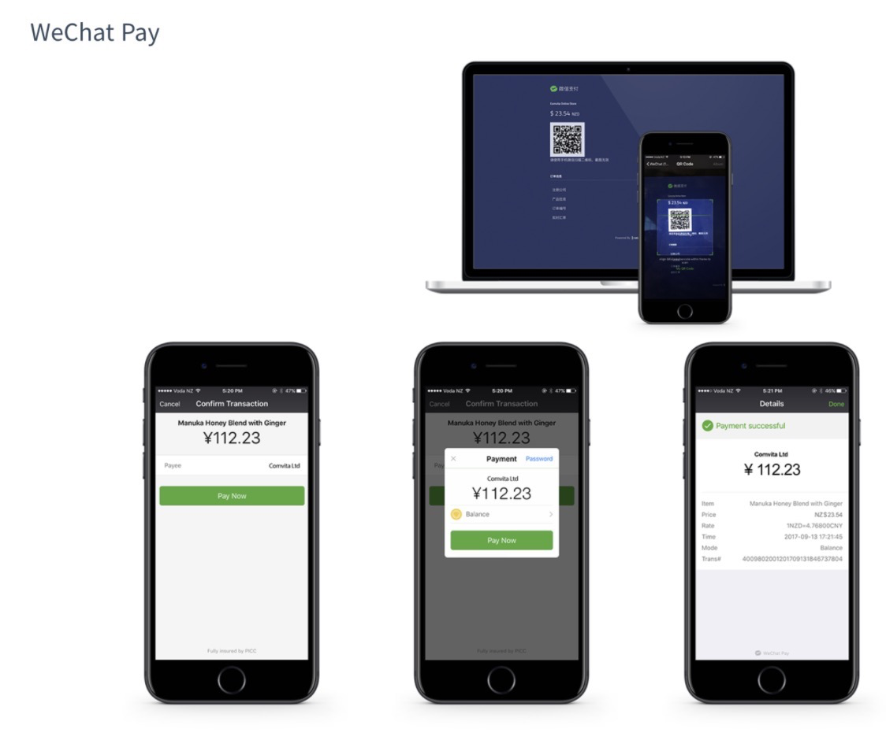
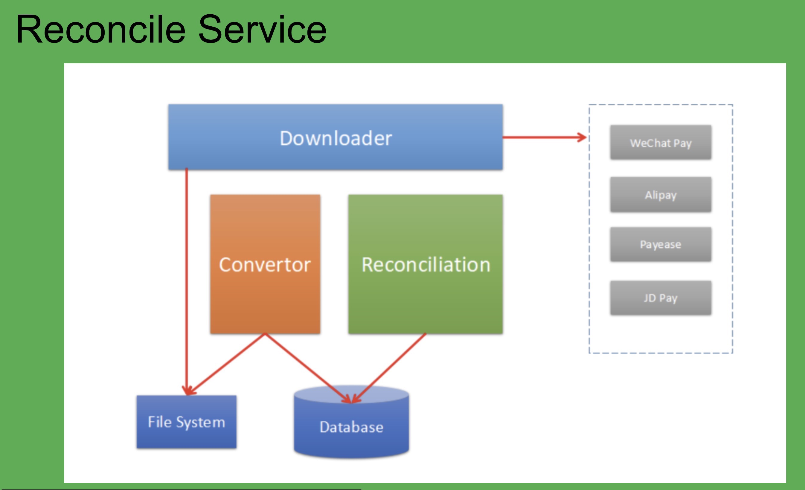

大家好，我是今天的分享人Shedon，目前就职于新西兰一家POS
Saas公司，高级工程师，主要负责POS支付集成开发。

今天的分享主要是对之前工作的一家新西兰本地做跨境聚合支付产品和系统的介绍，谢谢大家。

API主要用于代购网站或跨境电商网站的支付集成；

静态二维码，提供了一码多付，静态二维码埋的是平台的地址，扫描后，根据用户的User-agent来判断是微信还是支付宝支付，展示不同的支付金额输入界面，然后走对应的支付流程；

SpotPay是商家输入具体的收款金额，然后选择微信或支付，动态生成二维码供消费者扫码支付；

交学费应用主要使用的是网银支付，需要大额支付，网银支付是对接国内的首信易支付。

具体的产品截图如下

 

 

 

 

系统基于SpringBoot，Spring Cloud开发，具体系统架构如图所示.

前端使用React, 后端一少部分使用了NodeJS,其他服务为java服务。

由于系统之初负责架构的工程师不太认同微服务，所以看到的merchant
service服务中包含上了全部的服务功能，之后开始引入Spring
Cloud开始进行微服务的改造。

Merchant Service 集合了支付API，支付网关通知及merchant
portal的所有功能，是系统的核心服务；

Trade Service 为公司内部交易管理系统提供服务；

Notify Service不是支付回调的通知服务，支付通知回调功能在Merchant
Service中实现。Notify Service是用在微信公众号通知商户收到消费者支付。

Job
Service主要负责定时拉去支付网关汇率，商户自动提现以及对支付通知失败的订单重复通知。

Reconcile Service负责对账功能，具体设计参考了群主老熊的一篇博文设计。

下面对其中支付时序做个简单介绍。

微信支付共集成了两种支付方式，微信扫描码支付和微信公众号支付。

扫描支付主要用在用户通过电脑访问电商网站；

公众号支付主要用在用户通过微信访问电商网站，开发公众号支付的一个原因是，微信不允许在微信中长按二维码支付，很早之前可以，用户通过微信访问电商网站，然后通过长按出现的二维码完成支付。

去年申请到了境外H5支付，可以实现在普通手机浏览器中唤起微信支付，当时已离职，没再继续跟进了解。

微信扫码支付集成时序如下：

![微 信 支 付 、 V せ ぐ h t P y れ 一 せ “ ー 用 戸 商 ・ 广 BackEnd FrontEnd/ 、 OdeJs ー 支 イ 寸 ー 交 1 : 「 支 イ 寸 妛 殳 / 、 つ / tr 田 1 、 c ⅱ 。 n - i 4 ⅱ ー : redi rectUR ー . + n い nee ・ ・ 在 0 イ 言 中 [ 支 イ は 区 1 可 : 匚 芝 イd弌-I刊 + nonce Red irect : /pay/ + nonc メ 交 月 : wechat 支 イ 寸 网 美 委 殳 々 上 ま 里 支 イ 寸 网 美 , 数 強 居 -iE 回 : w 。 ch 支 イ 寸 网 美 数 噌 ー ・ お も 交 : 手 一 言 ー 支 イ 寸 iE 回 : [ 支 イ 寸 を 蓬 妾 ー り 誕 力 で : QR Code— 4 ヨ 石 支 イ 寸 リ 第 出 : 4 フ 、 密 石 - ー -. 民 : w 。 chat 芝 イ 密 石 査 i 匈 : 冫 ・ 否 支 イ 寸 完 ー - i 凾 匁 い ー 医 回 : ー 支 イ 寸 完 ) 戉 ー [ 支 イ を を 県 到 こ 芝 イ 、 」 ツ ! 面 - ー ミ 医 回 : 「 支 イ 寸 を 吉 : 県 一 医 回 : ](media/09dda65ee4acfc7dacf0ba783f1d65e4.png)

微信公众号支付集成时序如下：

公众号支付这里有一段逻辑是判断用户是否是微信浏览器打开，当时因为赶时间，很多都在后端java中完成，导致逻辑上有些绕。

支付宝也集成两种支付方式： 境外收单 -PC 和 Transaction QR Code Payment；

境外收单 -PC用于线上支付场景，Transaction QR Code Payment用于静态二维码。

境外收单 -PC支付，会将页面跳转到支付宝网站并展示二维码，

Transaction QR Code
Payment支付会根据提交的支付数据，返回二维码的地址，然后由平台控制二维码展示或直接发起支付宝支付。

网银支付的流程基本与支付宝扫描流程一样，也是向支付网关提交数据后，会跳转到网关平台，完成银行卡，手机号，身份证等信息填写后，完成支付，支付完成后会前端重定向到平台，同时也会有后台回调通知。

汇率问题：

微信支付，支付宝和首信易支付都提供实时汇率拉取接口，平台通过job服务定时获取最新汇率

微信支付和支付宝的接口都是接受外币，具体汇率由请求当时的微信支付宝决定，平台不能控制汇率，拉取的汇率只作为支付时，外币转人民币展示使用；

网银首信易支付接口只接受的是人民币，平台会在实时汇率上增加一定的点数来转换对应的人民币，以保证支付后获取足够的外币。

对账服务设计：

Downloader：负责每天定时或手动触发从微信、支付宝及首信易等支付渠道服务器上下载对账单，采用HTTP(S)方式下载对账单。

Convertor：负责解析对账单文件，将下载的对账文件解析并转换为可以对账的标准格式账单,并且入库。每个渠道的对账单格式不一，分别开发转换程序.

Reconciliation：负责核对支付渠道订单和平台交易记录之间的差异，输出差异记录。最后将差异记录导入到差异表中，同时完成对账统计及差错处理。

Fils System：用于存放从支付渠道下载对账单，供Convertor读取转换使用。

Database：平台订单记录，支付渠道转换后的表中订单记录，差错记录表，账单缓存记录，对账服务配置等。

系统服务部署使用docker，部署在国内杭州和香港，
因为大部分的用户都是在国内，所以把系统部署到了国内。

部署到国内会有个问题，有时候国内开重要会议的时候，访问就可能被干扰。

上周，又见到了一种新的集成跨境支付集成方式，由新西兰当地支付公司Smartpay提供，Smartpay与支付宝合作，将支付宝集成到了他们提供的刷卡支付终端上，在店内购物结账时，如果用户选择使用支付宝支付，则商户通过pos会将支付二维码显示在书卡终端上，用户扫描完成支付，此时用户扫描的二维码也不是支付宝的生成的二维码，而是有Smartpay生成的统一二维码，有点类似一码多付，Smartpay会根据用户的User-Agent来判断具体选择哪一个支付渠道。

以上就是我今天的一点分享，准备的不充分， 内容有点混乱，谢谢大家

 

Q:你们做的叫跨境聚合网关支付，可以这样理解不？

A:对的，就是聚合网关支付

S:从技术到业务都有，厉害了…

A:新西兰这边做聚合支付的公司很多，latipay，iemoney，epayment等等

S:关于实时汇率是以哪家作为参考的呢？每天对账应该是基于实时汇率的交易流水，我是这么理解的

A:这边平台不特定展示具体的汇率信息，只有在扫描支付的时候，展示换汇后人民币时展示汇率，是那种支付方式就展示那种的实时汇率，实际支付的汇率是支付宝和微信内部转的，只有首信易是传人民币给接口，需要对它的汇率准确性要求高。

微信支付宝扣用户人民币，给这边商家结算的时候是结算外币，所以只要保证外币金额是对的就可以，如果实时汇率不准确，出现的问题就是用户投诉，扫码看到的人民币金额和实际到微信/支付宝支付的时候，金额不一致。

Q:用实时汇率那每天对账的时候是用的抓取的实时汇率时点数吗？

A:不是，对账对外币的金额，目前首信易交易不大，且没提供对账单下载，没有进行对账

Q:请问下 方便透露下
微服务中间，注册中心，网关，服务注册与发现等所使用到的中间件选型吗？我们公司在重构系统，希望有点借鉴

A:所有的微服务是基于Spring Cloud来做的，因为开发服务的时候，用的是Spring Boot

注册中心：Eureka，网关Zuul，不过我走的时候没有完全做好。

我现在的公司是全部的微服务，用的是go写的，没有使用外部的框架，全部服务go来写，然后docker部署

S:用GO写全套微服务，会和Spring Cloud 有很大的差吗？

A:没有那写组建可以使用，所有的都需要自己写，如果公司人不是很多的，个人感觉使用Spring
Cloud来构建会更快一些，很多的功能都已经实现

Q:这么喜欢go啊，有spring cloud为什么不用呢

A:Spring cloud框架毕竟还是没有go的轻便，性能也不一样，go还有个好就是上手很快

A1:架构师是追求 性能极致的亲

S:从头做一个分布式架构，这公司挺牛的。还得补充一下，这公司还非常有钱

A:2年时间开发完

A1:确实 监控 限流 熔断 服务发现 动态配置 网关 权限 这些都是要花时间的
两年算不错的

A:是的

Q:国内银行，支付是不是有限额问题？

A:是有限额，同时网银支付的需要上传提供交易凭证

A1:个人外汇好像是五万的限额

A:你说外汇额度吗？5万美元

Q:对账服务是离线完成计算的吧，有用到hadoop吗

A:离线做的，支付宝微信都是第二天十点以后才能拿到对账单，交易量不大，没有用到hadoop

 
