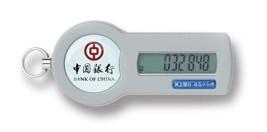

**几种身份认证方法及其应用**

身份认证概述
============

身份认证主要是能证明“我就是我”，包括静态密码、动态密码、数字证书、生物特征等几大类。

静态密码是一串固定的值，常见的有登录密码、交易密码、手机九宫格解锁等。

动态密码每次都会变化，包括手机短信验证码、动态令牌、条码支付和二维码支付等。

数字证书是基于数字签名技术，包括纯软件的软证书和基于U盾硬件的证书等

生物特征包括指纹、虹膜等。

不同的身份认证方法适用于不同应用场景，举例如下。

1.  动态密码

    1.  付款码

>   **场景**：微信、支付宝的条形码和二维码，隔一段时间变一下，一个条码只能用一次。

>   **不同应用场景下的网络要求**：

| 收款方 付款方 | 在线                   | 离线                       |
|---------------|------------------------|----------------------------|
| 在线          | 面对面转账             | 商家收款码                 |
| 离线          | 收银台扫码（短期离线） | 公交乘车付款码（联网结算） |

>   **优点：**适用场景多，对设备不挑剔

>   **弱点：**可以被截图盗用，或者直接骗取用户条形码的数字即可

OTP令牌
-------

>   **场景：**网游、电子银行等，6位数字每分钟一变，一个数字只能用一次

>   **网络要求：**无

>   **工作原理：**硬件内部计时精度很高，设备和后台根据当前时间和相同的密钥种子计算一个相同的值。验证时支持一定范围内窗口前后偏移匹配。也可以做成软件形式的装载到手机或电脑上。

>   **优点**：独立硬件，对网络无要求，对平台无要求，适用于电话、短信、网银、掌银等各种场景。

>   **缺点**：难以防止钓鱼，用户经常会收到假冒的银行升级短信，在短信中输入令牌值，钱就被偷走了。

1.  数字证书

    1.  原理

基于非对称密码技术，两个不同的密钥是一对，分别用于签名和验证，签名的自己保存好，验证的发给大家，谁都可以用。我打欠条的时候用自己的密钥（私钥）签名，苦主就可以向大家证明的确是我签的（公钥验证），因为能签名的密钥只有我自己有。

如何证明我的公钥就是我的而是不别人假冒我？我给大家的公钥都是可信方认证过的，也就是有可信方对我的公钥进行签名认证，大家验证可信方的签名没问题后，就认可我的这个公钥。公钥、ID、算法等一系列信息和可信方签名合起来体现在一个文件里，就是数字证书。其中可信方就是传说中的CA。

形态
----

数字证书在使用过程中，用户需要保存相应的私钥。私钥可以用软件保护（软证书），也可以用硬件保护（芯片卡、USBKey等安全介质）。

硬件保持私钥安全性更高，不过受限于硬件接口的固定性，使用范围受限；软证书可以应用于各类平台，不过安全性方面会差一些，央行有规定电子银行企业用户只用硬件介质。

1.  生物特征

    1.  指纹

指纹识别在大量手机上普及，不过其安全性很一般，像淘宝上几十块钱买一套指模材料，能骗过市面上大部分的手机指纹识别模块。

指纹比较的方法：并不是两张指纹照片进行比对，而是根据指纹照片提取一系列特征值，用特征值的相似度进行判别是否一致。

贵重的东西不能用指纹保管，曾经德国国防部长的指纹被通过一张普通的照片恢复出来。

虹膜
----

相比指纹，虹膜有更丰富的纹理特性，同时活体虹膜对光线强弱反应明显，所以活体检验很好做，识别准确度也很高。

亚洲人的虹膜呈现黑色居多，虹膜信息的采集需要红外摄像头，欧美的蓝色虹膜可以用普通摄像头。部分高端手机有虹膜识别功能。

如果带有美瞳，或者镀膜眼镜，会影响图像采集，进而使虹膜识别失效。

人脸
----

>   人脸识别技术方面的重点是人脸比对以及活体检测两方面。

>   目前在掌银大额转账以及ATM取款等方面有所应用。

>   在ATM应用中，人脸用于替代银行卡，要求客户输入密码完成交易。

>   对人脸识别的攻击和防御手段间列如下：

1.  照片：能攻击普通的手机人脸解锁，可通过要求用户点头、眨眼等动作进行核对判断

2.  硅胶面具：淘宝有售，能够仿冒别人的面部特征。一般通过增加红外摄像头通过红外图像特征是否能与普通照片匹配来识别。

3.  软件仿冒：315晚会演示的，通过软件改变，讲采集的人脸图像转换为目标人脸图像，同时保持动作不变，能够攻击远程非红外类型的眨眼等远程活体检测。

    1.  静脉

手掌纹理是外科手术难以复制的，那肢体中的血管纹理形状更是难以修改复制，所以用红外摄像头采集手指的指静脉纹理，或手掌的掌静脉纹理进行身份识别比对，是一种安全性很高的方式。
